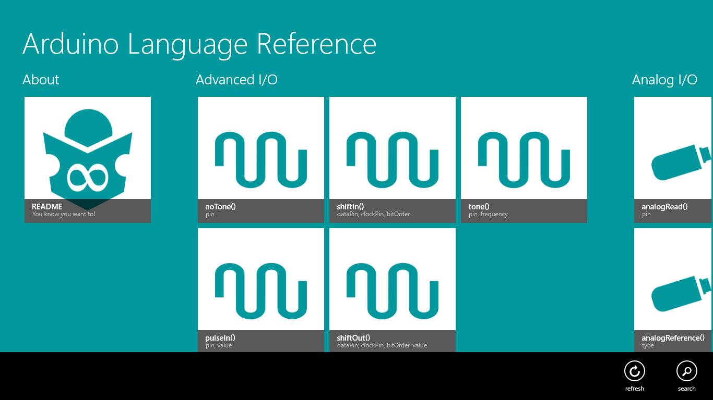
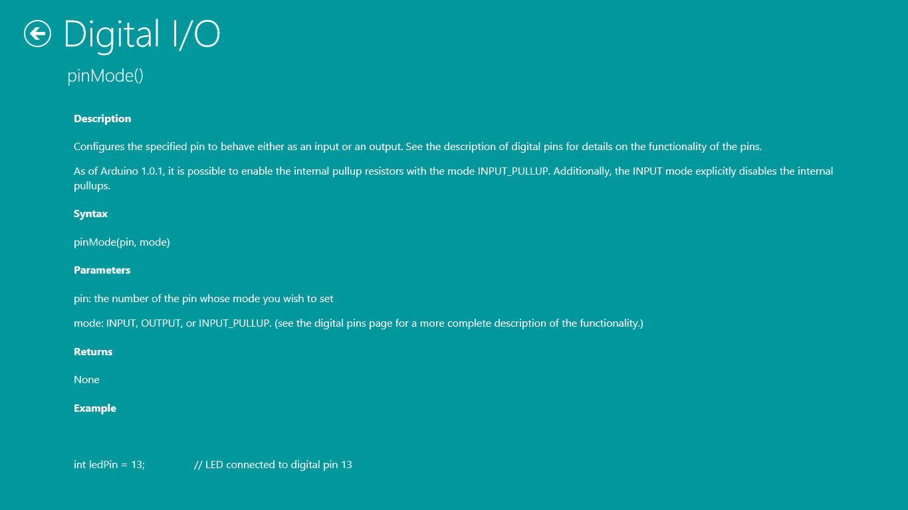
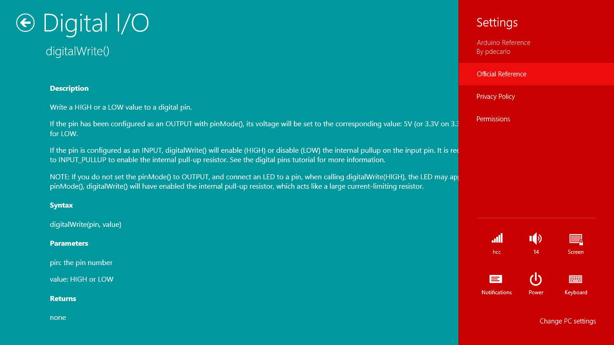

arduino-reference
=================
This app is a quick reference for Arduino newbies and ethusiasts alike. Designed for simplicity and ease-of-use, structures, variables, and functions are grouped both visually and categorically. Each tile is labeled and, where applicable, includes a brief mention of its parameters. Tapping on one will open up a detailed explanation. The complete, online reference is accessible from the Settings charm.

Method
======
Achieved using the [XPlatformCloudKit](http://aka.ms/XPlatformCloudKit) framework's [LocalItemsFile functionality](http://www.youtube.com/watch?v=hDEmKFSNQwI).

The app's content was extracted from the online [Arduino Language Reference](http://arduino.cc/en/Reference/HomePage). All content is static and designed for use offline.

Release
=======
Coming soon to Windows Store and Windows Phone Store

